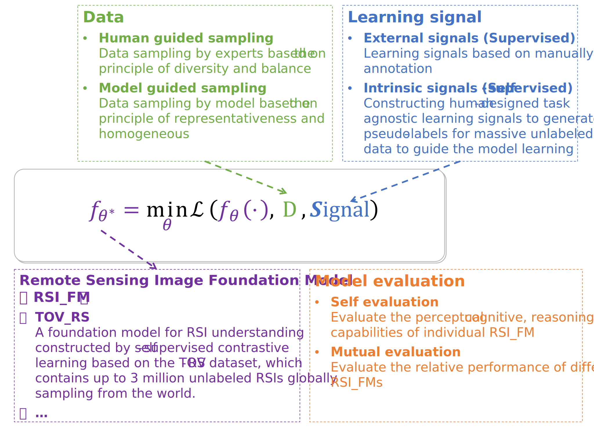

# G-RSIM

## Overview
This repository includes our works on Learning the General-purpose Remote Sensing Image Model (G-RSIM) for Remote Sensing Image understanding via self-supervisor learning.

The ideas behind our works can be abstracted and demonstrated in the following big picture.

<p align = 'center'>
  
</p>


In the proposed framework, remote sensing visual foundation model includes three parts: data, learning signal, model evaluation, which can be mathematically described as:

$$
f_{\theta^*}=\min_{\theta} \mathcal{L}\left(f_\theta(\cdot), D, \text { Signal }\right)
$$

In the part of data $D$, we first explore an automated sample collection method based on geographic data guidance, aiming to provide a large-scale, diverse, balanced, and easily scalable remote sensing image dataset for foundation model training[2]. Second, we further sample the training samples by exploring model features or gradient information to yield more representative and homogeneous samples[3].

In the part of learning $\mathbf{Signal}$, we focus on how to exploit the intrinsic learning signals of remote sensing data for model learning, rather than the traditional external signals, as the former is more capable of leveraging the value of large volumes of unannotated remote sensing images. At the theoretical level, we have sorted out and summarized the work on self-supervised representation learning for remote sensing images and written some review papers [1,7,8]. At the technical level, we have designed the corresponding self-supervised learning signals by combining the characteristics of remote sensing data itself [4-6].

In the part of model evaluation, we constructed the General Remote Sensing Image Understanding Benchmark (GRSIUB) to comprehensively and systematically evaluate the progress of foundation models on a wide range of remote sensing image visual tasks. The GRSIUB consists of 19 remote sensing image understanding tasks of varying difficulty, with varying data and limited labelling samples.

**The full list of works is as follows:**

### **(1) Review papers**

[1] Tao, Chao, Ji Qi, Mingning Guo, Qing Zhu, and Haifeng Li*. 2023. **‘Self-Supervised Remote Sensing Feature Learning: Learning Paradigms, Challenges, and Future Works’**. IEEE Transactions on Geoscience and Remote Sensing 1–1. doi: 10.1109/TGRS.2023.3276853.
   - [[Paper](https://ieeexplore.ieee.org/document/10126079)] or [arXiv](https://arxiv.org/abs/2211.08129).

[2] 陶超, 阴紫薇, 朱庆和李海峰*. 2021.**《遥感影像智能解译:从监督学习到自监督学习》**. 测绘学报 50(08):1122–34. (特邀稿)
   - [[Paper](https://kns.cnki.net/kcms2/article/abstract?v=3uoqIhG8C44YLTlOAiTRKibYlV5Vjs7iy_Rpms2pqwbFRRUtoUImHSE7i7PWr6_rbXYCr-h0wKFAkAPv5rjqr2HwmJN6B84s&uniplatform=NZKPT)]

### **(2) Models for learning General-purpose Remote Sensing Image Representation or Pre-trainning big model**

[1] Li, Haifeng, Yi Li, Guo Zhang, Ruoyun Liu, Haozhe Huang, Qing Zhu, and Chao Tao*. 2022. **‘Global and Local Contrastive Self-Supervised Learning for Semantic Segmentation of HR Remote Sensing Images’**. IEEE Transactions on Geoscience and Remote Sensing 60:1–14. doi: 10.1109/tgrs.2022.3147513.
   - [[Paper](https://ieeexplore.ieee.org/document/9696319/) or [arXiv](https://arxiv.org/abs/2106.10605) | [Code](https://github.com/GeoX-Lab/G-RSIM/tree/main/T-SS-GLCNet)]
     
[2] Tao, Chao, Ji Qi, Guo Zhang, Qing Zhu, Weipeng Lu, and Haifeng Li*. 2023. **‘TOV: The Original Vision Model for Optical Remote Sensing Image Understanding via Self-Supervised Learning’**. IEEE Journal of Selected Topics in Applied Earth Observations and Remote Sensing 1–16. doi: 10.1109/JSTARS.2023.3271312.
   - A **foundation model** for remote sensing image understanding
   - [[Paper](https://ieeexplore.ieee.org/document/10110958/) | [Code](https://github.com/GeoX-Lab/G-RSIM/tree/main/TOV_v1)]

[3] Wang, Xuying, Jiawei Zhu*, Zhengliang Yan, Zhaoyang Zhang, Yunsheng Zhang, Yansheng Chen, and Haifeng Li. 2022. **‘LaST: Label-Free Self-Distillation Contrastive Learning With Transformer Architecture for Remote Sensing Image Scene Classification’**. IEEE Geoscience and Remote Sensing Letters 19:1–5. doi: 10.1109/LGRS.2022.3185088.
   - [[Paper](https://ieeexplore.ieee.org/document/9802117/) | [Code]()]

[4] Huang, Haozhe, Zhongfeng Mou, Yunying Li, Qiujun Li, Jie Chen and Haifeng Li*. 2022. **‘Spatial-Temporal Invariant Contrastive Learning for Remote Sensing Scene Classification’**. IEEE Geoscience and Remote Sensing Letters 19:1–5. doi: 10.1109/LGRS.2022.3173419.
   - [[Paper](https://ieeexplore.ieee.org/document/9770815/) | [Code](https://github.com/GeoX-Lab/G-RSIM/tree/main/T-SC-STICL)]

[5] Tao, Chao, Ji Qi, Weipeng Lu, Hao Wang, and Haifeng Li*. 2020. **‘Remote Sensing Image Scene Classification With Self-Supervised Paradigm Under Limited Labeled Samples’**. IEEE Geoscience and Remote Sensing Letters 19:1–5. doi: 10.1109/LGRS.2020.3038420.
   - [[Paper](https://ieeexplore.ieee.org/document/9284640/) | [Code](https://github.com/ErenTuring/RSISC_SSL_Paradigm)]

[5] Li, Haifeng, Jing, Wenxian, Wei, Guo, Wu, Kai, Su, Mingming, Liu, Lu, Li, Penglong, Qi, Ji*. 2020. **‘RiSSNet: Contrastive Learning Network with a Relaxed Identity Sampling Strategy for Remote Sensing Image Semantic Segmentation’**. Remote Sensing. 2023, 15(13):3427. doi: 10.1109/10.1109/10.3390/rs15133427.
   - [[Paper]([https://ieeexplore.ieee.org/document/9284640/](https://www.mdpi.com/2072-4292/15/13/3427)) | [Code]()]

### **(3) Models for handling the False Negative Samples Issue in Contrastive Learning**

[1] Zhang, Zhaoyang, Xuying Wang, Xiaoming Mei, Chao Tao, and Haifeng Li*. 2022. **‘GraSS: Contrastive Learning with Gradient Guided Sampling Strategy for Remote Sensing Image Semantic Segmentation’**. IEEE Transactions on Geoscience and Remote Sensing. 2023. doi: 10.1109/LGRS.2022.3222836.
   - [[Paper](https://ieeexplore.ieee.org/document/10328629) or [arXiv](https://arxiv.org/abs/2306.15868) | [Code](https://github.com/GeoX-Lab/GraSS)]

[2] Zhang, Zhaoyang, Xuying Wang, Xiaoming Mei, Chao Tao, and Haifeng Li*. 2022. **‘FALSE: False Negative Samples Aware Contrastive Learning for Semantic Segmentation of High-Resolution Remote Sensing Image’**. IEEE Geoscience and Remote Sensing Letters 19:1–5. doi: 10.1109/LGRS.2022.3222836.
   - [[Paper](https://ieeexplore.ieee.org/document/9954056/) or [arXiv](https://arxiv.org/abs/2211.07928) https://arxiv.org/abs/2211.07928 | [Code](https://github.com/GeoX-Lab/FALSE)] 

[3] Zhang, Zhaoyang, Jing, Wenxuan, Li, Haifeng, Tao, Chao, Zhang, Yunsheng*. 2022. **‘GFCNet: Contrastive Learning Network with Geography Feature Space Joint Negative Sample Correction for Land Cover Classification’**. Remote Sensing. 2023 19:1–5. doi: 10.1109/LGRS.2022.3222836.
   - [[Paper](10.3390/rs15205056) | [Code]()]

## (1) Review papers

### (2023) *Self-supervised remote sensing feature learning: Learning Paradigms, Challenges, and Future Works*
Deep learning has achieved great success in learning features from massive remote sensing images (RSIs). To better understand the connection between three feature learning paradigms, which are unsupervised feature learning (USFL), supervised feature learning (SFL), and self-supervised feature learning (SSFL), this paper analyzes and compares them from the perspective of feature learning signals, and gives a unified feature learning framework. Under this unified framework, we analyze the advantages of SSFL over the other two learning paradigms in RSI understanding tasks and give a comprehensive review of existing SSFL works in RS, including the pre-training dataset, self-supervised feature learning signals, and the evaluation methods. We further analyze the effects of SSFL signals and pre-training data on the learned features to provide insights into RSI feature learning. Finally, we briefly discuss some open problems and possible research directions.

```bibteX
@ARTICLE{10126079,
  author={Tao, Chao and Qi, Ji and Guo, Mingning and Zhu, Qing and Li, Haifeng},
  journal={IEEE Transactions on Geoscience and Remote Sensing}, 
  title={Self-supervised Remote Sensing Feature Learning: Learning Paradigms, Challenges, and Future Works}, 
  year={2023},
  volume={},
  number={},
  pages={1-1},
  doi={10.1109/TGRS.2023.3276853}}
```


### (2021) *遥感影像智能解译:从监督学习到自监督学习*

遥感影像精准解译是遥感应用落地的核心和关键技术。近年来,以深度学习为代表的监督学习方法凭借其强大的特征学习能力,在遥感影像智能解译领域较传统方法取得了突破性进展。这一方法的成功严重依赖于大规模、高质量的标注数据,而遥感影像解译对象独特的时空异质性特点使得构建一个完备的人工标注数据库成本极高,这一矛盾严重制约了以监督学习为基础的遥感影像解译方法在大区域、复杂场景下的应用。如何破解遥感影像精准解译"最后一千米"已成为业界亟待解决的问题。针对该问题,本文系统地总结和评述了监督学习方法在遥感影像智能解译领域的主要研究进展,并分析其存在的不足和背后原因。在此基础上,重点介绍了自监督学习作为一种新兴的机器学习范式在遥感影像智能解译中的应用潜力和主要研究问题,阐明了遥感影像解译思路从监督学习转化到自监督学习的意义和价值,以期为数据源极大丰富条件下开展遥感影像智能解译研究提供新的视角。 


```bibteX
@ARTICLE{9284640,
  author={陶超 and 阴紫薇 and 朱庆 and 李海峰*},
  journal={测绘学报}, 
  title={遥感影像智能解译:从监督学习到自监督学习}, 
  year={2021},
  volume={50},
  number={8},
  pages={1122-1134},
  doi={}}
```


## (2) Models for learning General-purpose Remote Sensing Image Representation or Pre-trainning big model

### (2022) Global and Local Contrastive Self-Supervised Learning for Semantic Segmentation of HR Remote Sensing Images
Recently, supervised deep learning has achieved a great success in remote sensing image (RSI) semantic segmentation. However, supervised learning for semantic segmentation requires a large number of labeled samples, which is difficult to obtain in the field of remote sensing. A new learning paradigm, self-supervised learning (SSL), can be used to solve such problems by pretraining a general model with a large number of unlabeled images and then fine-tuning it on a downstream task with very few labeled samples. Contrastive learning is a typical method of SSL that can learn general invariant features. However, most existing contrastive learning methods are designed for classification tasks to obtain an image-level representation, which may be suboptimal for semantic segmentation tasks requiring pixel-level discrimination. Therefore, we propose a global style and local matching contrastive learning network (GLCNet) for RSI semantic segmentation. Specifically, first, the global style contrastive learning module is used to better learn an image-level representation, as we consider that style features can better represent the overall image features. Next, the local features matching the contrastive learning module is designed to learn the representations of local regions, which is beneficial for semantic segmentation. We evaluate four RSI semantic segmentation datasets, and the experimental results show that our method mostly outperforms the state-of-the-art self-supervised methods and the ImageNet pretraining method. Specifically, with 1% annotation from the original dataset, our approach improves Kappa by 6% on the International Society for Photogrammetry and Remote Sensing (ISPRS) Potsdam dataset relative to the existing baseline. Moreover, our method outperforms supervised learning methods when there are some differences between the datasets of upstream tasks and downstream tasks. Our study promotes the development of SSL in the field of RSI semantic segmentation. Since SSL could directly learn the essential characteristics of data from unlabeled data, which is easy to obtain in the remote sensing field, this may be of great significance for tasks such as global mapping.


```bibteX
@ARTICLE{9696319,
  author={Li, Haifeng and Li, Yi and Zhang, Guo and Liu, Ruoyun and Huang, Haozhe and Zhu, Qing and Tao, Chao},
  journal={IEEE Transactions on Geoscience and Remote Sensing}, 
  title={Global and Local Contrastive Self-Supervised Learning for Semantic Segmentation of HR Remote Sensing Images}, 
  year={2022},
  volume={60},
  number={},
  pages={1-14},
  doi={10.1109/TGRS.2022.3147513}}
```


### (2023) *TOV: The Original Vision Model for Optical Remote Sensing Image Understanding via Self-Supervised Learning*
Are we on the right way for remote sensing image understanding (RSIU) by training models in a supervised data-dependent and task-dependent manner, instead of original human vision in a label-free and task-independent way? We argue that a more desirable RSIU model should be trained with intrinsic structure from data rather than extrinsic human labels to realize generalizability across a wide range of RSIU tasks. According to this hypothesis, we proposed T he O riginal V ision model (TOV) in the remote sensing field. Trained by massive unlabeled optical data along a human-like self-supervised learning (SSL) path that is from general knowledge to specialized knowledge, TOV model can be easily adapted to various RSIU tasks, including scene classification, object detection, and semantic segmentation, and outperforms dominant ImageNet supervised pre-trained method as well as two recently proposed SSL pre-trained methods on the majority of 12 publicly available benchmarks. Moreover, we analyze the influences of two key factors on the performance of building TOV model for RSIU, including the influence of using different data sampling methods and the selection of learning paths during self-supervised optimization. We believe that a general model which is trained in a label-free and task-independent way may be the next paradigm for RSIU and hope the insights distilled from this study can help to foster the development of an original vision model for RSIU.


```bibteX
@ARTICLE{10110958,
  author={Tao, Chao and Qi, Ji and Zhang, Guo and Zhu, Qing and Lu, Weipeng and Li, Haifeng},
  journal={IEEE Journal of Selected Topics in Applied Earth Observations and Remote Sensing}, 
  title={TOV: The Original Vision Model for Optical Remote Sensing Image Understanding via Self-Supervised Learning}, 
  year={2023},
  volume={},
  number={},
  pages={1-16},
  doi={10.1109/JSTARS.2023.3271312}}
```

### (2022) *LaST: Label-Free Self-Distillation Contrastive Learning With Transformer Architecture for Remote Sensing Image Scene Classification*
The increase in self-supervised learning (SSL), especially contrastive learning, has enabled one to train deep neural network models with unlabeled data for remote sensing image (RSI) scene classification. Nevertheless, it still suffers from the following issues: 1) the performance of the contrastive learning method is significantly impacted by the hard negative sample (HNS) issue, since the RSI scenario is complex in semantics and rich in surface features; 2) the multiscale characteristic of RSI is missed in the existing contrastive learning methods; and 3) as the backbone of a deep learning model, especially in the case of limited annotation, a convolutional neural network (CNN) does not include the adequate receptive field of convolutional kernels to capture the broad contextual information of RSI. In this regard, we propose label-free self-distillation contrastive learning with a transformer architecture (LaST). We introduce the self-distillation contrastive learning mechanism to address the HNS issue. Specifically, the LaST architecture comprises two modules: scale alignment with a multicrop module and a long-range dependence capture backbone module. In the former, we present global–local crop and scale alignment to encourage local-to-global correspondence and acquire multiscale relations. Then, the distorted views are fed into a transformer as a backbone, which is good at capturing the long-range-dependent contextual information of the RSI while maintaining the spatial smoothness of the learned features. Experiments on public datasets show that in the downstream scene classification task, LaST improves the performance of the self-supervised trained model by a maximum of 2.18% compared to the HNS-impacted contrastive learning approaches, and only 1.5% of labeled data can achieve the performance of supervised training CNNs with 10% labeled data. Moreover, this letter supports the integration of a transformer architecture and self-supervised paradigms in RSI interpretation.


```bibteX
@ARTICLE{9802117,
  author={Wang, Xuying and Zhu, Jiawei and Yan, Zhengliang and Zhang, Zhaoyang and Zhang, Yunsheng and Chen, Yansheng and Li, Haifeng},
  journal={IEEE Geoscience and Remote Sensing Letters}, 
  title={LaST: Label-Free Self-Distillation Contrastive Learning With Transformer Architecture for Remote Sensing Image Scene Classification}, 
  year={2022},
  volume={19},
  number={},
  pages={1-5},
  doi={10.1109/LGRS.2022.3185088}}
```


### (2022) *Spatial-Temporal Invariant Contrastive Learning for Remote Sensing Scene Classification*
Self-supervised learning achieves close to supervised learning results on remote sensing image (RSI) scene classification. This is due to the current popular self-supervised learning methods that learn representations by applying different augmentations to images and completing the instance discrimination task which enables convolutional neural networks (CNNs) to learn representations invariant to augmentation. However, RSIs are spatial-temporal heterogeneous, which means that similar features may exhibit different characteristics in different spatial-temporal scenes. Therefore, the performance of CNNs that learn only representations invariant to augmentation still degrades for unseen spatial-temporal scenes due to the lack of spatial-temporal invariant representations. We propose a spatial-temporal invariant contrastive learning (STICL) framework to learn spatial-temporal invariant representations from unlabeled images containing a large number of spatial-temporal scenes. We use optimal transport to transfer an arbitrary unlabeled RSI into multiple other spatial-temporal scenes and then use STICL to make CNNs produce similar representations for the views of the same RSI in different spatial-temporal scenes. We analyze the performance of our proposed STICL on four commonly used RSI scene classification datasets, and the results show that our method achieves better performance on RSIs in unseen spatial-temporal scenes compared to popular self-supervised learning methods. Based on our findings, it can be inferred that spatial-temporal invariance is an indispensable property for a remote sensing model that can be applied to a wider range of remote sensing tasks, which also inspires the study of more general remote sensing models.


```bibteX
@ARTICLE{9770815,
  author={Huang, Haozhe and Mou, Zhongfeng and Li, Yunying and Li, Qiujun and Chen, Jie and Li, Haifeng},
  journal={IEEE Geoscience and Remote Sensing Letters}, 
  title={Spatial-Temporal Invariant Contrastive Learning for Remote Sensing Scene Classification}, 
  year={2022},
  volume={19},
  number={},
  pages={1-5},
  doi={10.1109/LGRS.2022.3173419}}
```


### (2020) *Remote Sensing Image Scene Classification With Self-Supervised Paradigm Under Limited Labeled Samples*
With the development of deep learning, supervised learning methods perform well in remote sensing image (RSI) scene classification. However, supervised learning requires a huge number of annotated data for training. When labeled samples are not sufficient, the most common solution is to fine-tune the pretraining models using a large natural image data set (e.g., ImageNet). However, this learning paradigm is not a panacea, especially when the target RSIs (e.g., multispectral and hyperspectral data) have different imaging mechanisms from RGB natural images. To solve this problem, we introduce a new self-supervised learning (SSL) mechanism to obtain the high-performance pretraining model for RSI scene classification from large unlabeled data. Experiments on three commonly used RSI scene classification data sets demonstrated that this new learning paradigm outperforms the traditional dominant ImageNet pretrained model. Moreover, we analyze the impacts of several factors in SSL on RSI scene classification, including the choice of self-supervised signals, the domain difference between the source and target data sets, and the amount of pretraining data. The insights distilled from this work can help to foster the development of SSL in the remote sensing community. Since SSL could learn from unlabeled massive RSIs, which are extremely easy to obtain, it will be a promising way to alleviate dependence on labeled samples and thus efficiently solve many problems, such as global mapping.


```bibteX
@ARTICLE{9284640,
  author={Tao, Chao and Qi, Ji and Lu, Weipeng and Wang, Hao and Li, Haifeng},
  journal={IEEE Geoscience and Remote Sensing Letters}, 
  title={Remote Sensing Image Scene Classification With Self-Supervised Paradigm Under Limited Labeled Samples}, 
  year={2022},
  volume={19},
  number={},
  pages={1-5},
  doi={10.1109/LGRS.2020.3038420}}
```


### (2020) *RiSSNet: Contrastive Learning Network with a Relaxed Identity Sampling Strategy for Remote Sensing Image Semantic Segmentation*
Contrastive learning techniques make it possible to pretrain a general model in a self-supervised paradigm using a large number of unlabeled remote sensing images. The core idea is to pull positive samples defined by data augmentation techniques closer together while pushing apart randomly sampled negative samples to serve as supervised learning signals. This strategy is based on the strict identity hypothesis, i.e., positive samples are strictly defined by each (anchor) sample’s own augmentation transformation. However, this leads to the over-instancing of the features learned by the model and the loss of the ability to fully identify ground objects. Therefore, we proposed a relaxed identity hypothesis governing the feature distribution of different instances within the same class of features. The implementation of the relaxed identity hypothesis requires the sampling and discrimination of the relaxed identical samples. In this study, to realize the sampling of relaxed identical samples under the unsupervised learning paradigm, the remote sensing image was used to show that nearby objects often present a large correlation; neighborhood sampling was carried out around the anchor sample; and the similarity between the sampled samples and the anchor samples was defined as the semantic similarity. To achieve sample discrimination under the relaxed identity hypothesis, the feature loss was calculated and reordered for the samples in the relaxed identical sample queue and the anchor samples, and the feature loss between the anchor samples and the sample queue was defined as the feature similarity. Through the sampling and discrimination of the relaxed identical samples, the leap from instance-level features to class-level features was achieved to a certain extent while enhancing the network’s invariant learning of features. We validated the effectiveness of the proposed method on three datasets, and our method achieved the best experimental results on all three datasets compared to six self-supervised methods.


```bibteX
@ARTICLE{9770815,
  author={Li, Haifeng and Jing, Wenxian and Wei, Guo and Wu, Kai and Su, Mingming and Liu, Lu and Li, Penglong and Qi, Ji},
  journal={Remote Sensing}, 
  title={RiSSNet: Contrastive Learning Network with a Relaxed Identity Sampling Strategy for Remote Sensing Image Semantic Segmentation}, 
  year={2023},
  volume={15},
  number={13},
  pages={3427},
  doi={10.1109/10.3390/rs15133427}}
```


## (3) Models for handling the False Negative Samples Issue in Contrastive Learning 


### (2023) *GraSS: Contrastive Learning with Gradient Guided Sampling Strategy for Remote Sensing Image Semantic Segmentation*
Self-supervised contrastive learning (SSCL) has achieved significant milestones in remote sensing image (RSI) understanding. Its essence lies in designing an unsupervised instance discrimination pretext task to extract image features from a large number of unlabeled images that are beneficial for downstream tasks. However, existing instance discrimination based SSCL suffers from two limitations when applied to the RSI semantic segmentation task: 1) Positive sample confounding issue, SSCL treats different augmentations of the same RSI as positive samples, but the richness, complexity, and imbalance of RSI ground objects lead to the model actually pulling a variety of different ground objects closer while pulling positive samples closer, which confuse the feature of different ground objects. 2) Feature adaptation bias, SSCL treats RSI patches containing various ground objects as individual instances for discrimination and obtains instance-level features, which are not fully adapted to pixel-level or object-level semantic segmentation tasks. To address the above limitations, we consider constructing samples containing single ground objects to alleviate positive sample confounding issue, and make the model obtain object-level features from the contrastive between single ground objects. Meanwhile, we observed that the discrimination information can be mapped to specific regions in RSI through the gradient of unsupervised contrastive loss, these specific regions tend to contain single ground objects. Based on this, we propose contrastive learning with Gradient guided Sampling Strategy (GraSS) for RSI semantic segmentation. GraSS consists of two stages: 1) the instance discrimination warm-up stage to provide initial discrimination information to the contrastive loss gradients, 2) the gradient guided sampling contrastive training stage to adaptively construct samples containing more singular ground objects using the discrimination information. Experimental results on three open datasets demonstrate that GraSS effectively enhances the performance of SSCL in high-resolution RSI semantic segmentation. Compared to eight baseline methods from six different types of SSCL, GraSS achieves an average improvement of 1.57\% and a maximum improvement of 3.58\% in terms of mean intersection over the union. Additionally, we discovered that the unsupervised contrastive loss gradients contain rich feature information, which inspires us to utilize gradient information more extensively during model training to attain additional model capacity. The source code is available at https://github.com/GeoX-Lab/GraSS.


```bibteX
@ARTICLE{9954056,
  author={Zhang, Zhaoyang and Ren, Zhen and Tao, Chao and Zhang, Yunsheng and Peng, Chengli and Li, Haifeng},
  journal={IEEE Transactions on Geoscience and Remote Sensing}, 
  title={GraSS: Contrastive Learning with Gradient Guided Sampling Strategy for Remote Sensing Image Semantic Segmentation}, 
  year={2023},
  volume={},
  number={},
  pages={1-14},
  doi={10.1109/TGRS.2023.3336285}}
```


### (2022) *FALSE: False Negative Samples Aware Contrastive Learning for Semantic Segmentation of High-Resolution Remote Sensing Image*
Self-supervised contrastive learning (SSCL) is a potential learning paradigm for learning remote sensing image (RSI)-invariant features through the label-free method. The existing SSCL of RSI is built based on constructing positive and negative sample pairs. However, due to the richness of RSI ground objects and the complexity of the RSI contextual semantics, the same RSI patches have the coexistence and imbalance of positive and negative samples, which causes the SSCL pushing negative samples far away while pushing positive samples far away, and vice versa. We call this the sample confounding issue (SCI). To solve this problem, we propose a False negAtive sampLes aware contraStive lEarning model (FALSE) for the semantic segmentation of high-resolution RSIs. Since SSCL pretraining is unsupervised, the lack of definable criteria for false negative sample (FNS) leads to theoretical undecidability, and we designed two steps to implement the FNS approximation determination: coarse determination of FNS and precise calibration of FNS. We achieve coarse determination of FNS by the FNS self-determination (FNSD) strategy and achieve calibration of FNS by the FNS confidence calibration (FNCC) loss function. Experimental results on three RSI semantic segmentation datasets demonstrated that the FALSE effectively improves the accuracy of the downstream RSI semantic segmentation task compared with the current three models, which represent three different types of SSCL models. The mean intersection over union (mIoU) on the ISPRS Potsdam dataset is improved by 0.7% on average; on the CVPR DGLC dataset, it is improved by 12.28% on average; and on the Xiangtan dataset, this is improved by 1.17% on average. This indicates that the SSCL model has the ability to self-differentiate FNS and that the FALSE effectively mitigates the SCI in SSCL.


```bibteX
@ARTICLE{9954056,
  author={Zhang, Zhaoyang and Wang, Xuying and Mei, Xiaoming and Tao, Chao and Li, Haifeng},
  journal={IEEE Geoscience and Remote Sensing Letters}, 
  title={FALSE: False Negative Samples Aware Contrastive Learning for Semantic Segmentation of High-Resolution Remote Sensing Image}, 
  year={2022},
  volume={19},
  number={},
  pages={1-5},
  doi={10.1109/LGRS.2022.3222836}}
```


### (2022) *GFCNet: Contrastive Learning Network with Geography Feature Space Joint Negative Sample Correction for Land Cover Classification*
With the continuous improvement in the volume and spatial resolution of remote sensing images, the self-supervised contrastive learning paradigm driven by a large amount of unlabeled data is expected to be a promising solution for large-scale land cover classification with limited labeled data. However, due to the richness and scale diversity of ground objects contained in remote sensing images, self-supervised contrastive learning encounters two challenges when performing large-scale land cover classification: (1) Self-supervised contrastive learning models treat random spatial–spectral transformations of different images as negative samples, even though they may contain the same ground objects, which leads to serious class confusion in land cover classification. (2) The existing self-supervised contrastive learning models simply use the single-scale features extracted by the feature extractor for land cover classification, which limits the ability of the model to capture different scales of ground objects in remote sensing images. In this study, we propose a contrastive learning network with Geography Feature space joint negative sample Correction (GFCNet) for land cover classification. To address class confusion, we propose a Geography Feature space joint negative sample Correction Strategy (GFCS), which integrates the geography space and feature space relationships of different images to construct negative samples, reducing the risk of negative samples containing the same ground object. In order to improve the ability of the model to capture the features of different scale ground objects, we adopt a Multi-scale Feature joint Fine-tuning Strategy (MFFS) to integrate different scale features obtained by the self-supervised contrastive learning network for land cover classification tasks. We evaluate the proposed GFCNet on three public land cover classification datasets and achieve the best results compared to seven baselines of self-supervised contrastive learning methods. Specifically, on the LoveDA Rural dataset, the proposed GFCNet improves 3.87% in Kappa and 1.54% in mIoU compared with the best baseline.


```bibteX
@ARTICLE{9954056,
  author={Zhang, Zhaoyang and Jing, Wenxuan and Li, Haifeng and Tao, Chao and Zhang, Yunsheng},
  journal={Remote Sensing}, 
  title={GFCNet: Contrastive Learning Network with Geography Feature Space Joint Negative Sample Correction for Land Cover Classification}, 
  year={2023},
  volume={15},
  number={20},
  pages={5056},
  doi={10.3390/rs15205056}}
```
